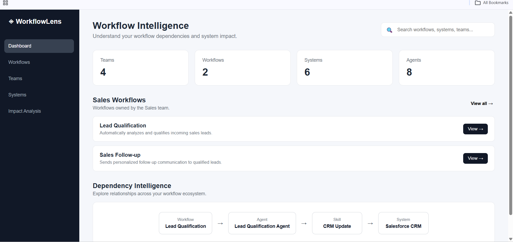
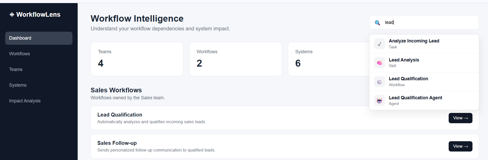
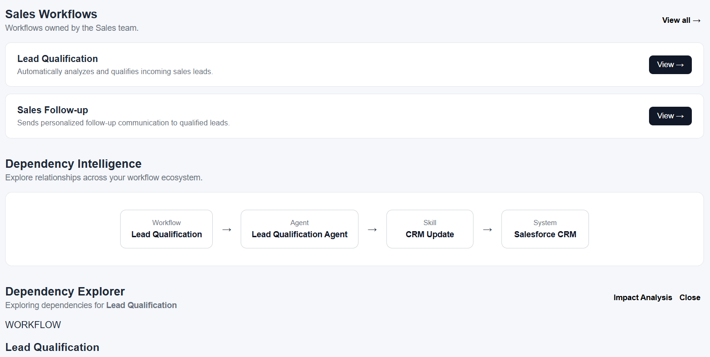
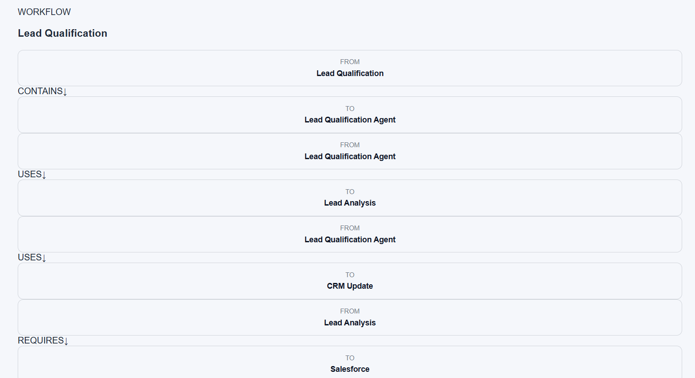
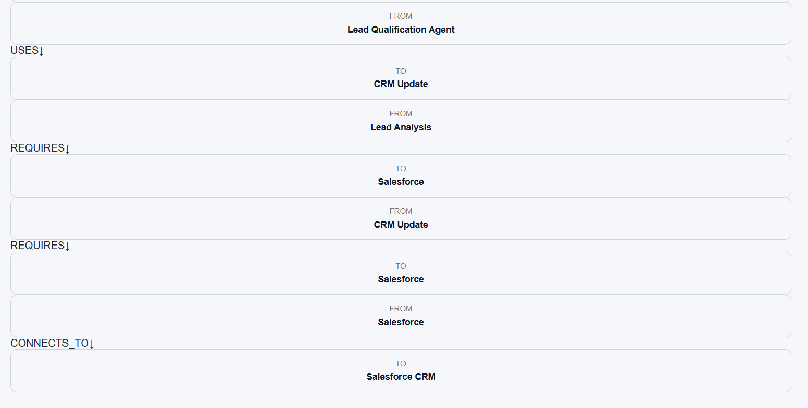
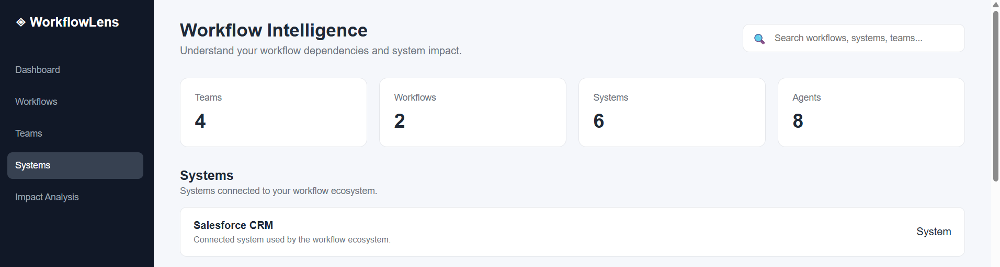

# WorkflowLens — Workflow Intelligence with CognoDB

WorkflowLens is a workflow intelligence application built for the Wexa AI CognoDB assignment.

It models workflows, agents, skills, connectors, systems, and teams as a connected graph. The application allows users to search across the workflow ecosystem, explore dependencies, and understand the potential impact of changes to connected components.

---

## 1. Use Case

Modern organizations often have workflows that depend on multiple agents, skills, external connectors, and business systems.

For example:

```text
Lead Qualification
        |
     CONTAINS
        ↓
Lead Qualification Agent
        |
       USES
        ↓
Lead Analysis
        |
    REQUIRES
        ↓
Salesforce Connector
        |
   CONNECTS_TO
        ↓
Salesforce CRM
```
If Salesforce CRM becomes unavailable or a workflow component changes, it can be difficult to understand which workflows and components are affected.<br><br>
WorkflowLens addresses this problem by representing these dependencies as a graph. <br><br>
The application provides:
- Workflow discovery
- Global search
- Dependency exploration
- Relationship visualization
- Impact analysis
- Team and system views
---
## 2. Why a Graph Database?
WorkflowLens deals primarily with relationships between entities.<br><br>
The important information is not only:<br><br>
&nbsp; &nbsp; "What is this workflow?"<br><br>
but also:<br><br>
&nbsp; &nbsp; "What does this workflow depend on?"<br><br>
and:<br><br>
&nbsp; &nbsp; "What could be affected if this system changes?"<br><br>
A graph database is a natural fit because relationships are first-class data.<br><br>
The application models relationships such as:
```text
Team ──OWNS──> Workflow

Workflow ──CONTAINS──> Agent

Agent ──USES──> Skill

Skill ──REQUIRES──> Connector

Connector ──CONNECTS_TO──> System
```
With a graph model, these relationships can be traversed directly to discover dependencies and potential impact.<br><br>
This is particularly useful for:<br>
- Dependency analysis
- Impact analysis
- Connected-system discovery
- Relationship-based search
- Future multi-hop dependency analysis

A relational database could represent these relationships using multiple tables and joins, but the graph model keeps the domain relationships explicit and makes relationship traversal a central operation.

## 3. Data Model
The core graph contains the following entities:

**Nodes** 
* Team
* Workflow
* Agent
* Skill
* Connector
* System
* Task

**Relationships**
- OWNS
- CONTAINS
- USES
- REQUIRES
- CONNECTS_TO
- HAS_TASK

**Example**
```text
Team
  |
  | OWNS
  ↓
Workflow
  |
  | CONTAINS
  ↓
Agent
  |
  | USES
  ↓
Skill
  |
  | REQUIRES
  ↓
Connector
  |
  | CONNECTS_TO
  ↓
System
```
---
## 4. Data Model Diagram
The main dependency model used by WorkflowLens can be represented as:

                    ┌─────────────┐
                    │    Team     │
                    └──────┬──────┘
                           │
                          OWNS
                           │
                           ▼
                    ┌─────────────┐
                    │  Workflow   │
                    └──────┬──────┘
                           │
                        CONTAINS
                           │
                           ▼
                    ┌─────────────┐
                    │    Agent    │
                    └──────┬──────┘
                           │
                          USES
                           │
                           ▼
                    ┌─────────────┐
                    │    Skill    │
                    └──────┬──────┘
                           │
                        REQUIRES
                           │
                           ▼
                    ┌─────────────┐
                    │  Connector  │
                    └──────┬──────┘
                           │
                      CONNECTS_TO
                           │
                           ▼
                    ┌─────────────┐
                    │   System    │
                    └─────────────┘
---
## 5. Architecture
WorkflowLens uses a simple layered architecture.
```text
┌───────────────────────────────┐
│          React UI             │
│                               │
│ Dashboard / Search / Explorer │
│ Impact Analysis / Teams       │
│ Systems                       │
└───────────────┬───────────────┘
                │ REST API
                ▼
┌───────────────────────────────┐
│       Spring Boot API         │
│                               │
│ Controllers                   │
│ Services                      │
│ Repository / Graph Queries    │
└───────────────┬───────────────┘
                │
                ▼
┌───────────────────────────────┐
│           CognoDB             │
│        Graph Database         │
│                               │
│ Nodes + Relationships         │
└───────────────────────────────┘
```
---
## 6. Technology Stack

### Backend
+ Java
+ Spring Boot
+ Spring Web
+ Spring Data / Neo4j integration
+ Maven
+ Cypher
### Frontend
+ React
+ Vite
+ JavaScript
+ CSS
### Database
+ CognoDB
+ Graph data model
+ Cypher queries
### API Testing
+ Postman

---
## 7. Project Structure
```text
workflowlens/
│
├── workflowlens-backend/
│   ├── src/
│   │   ├── main/
│   │   │   ├── java/
│   │   │   │   └── com/workflowlens/
│   │   │   │       ├── config/
│   │   │   │       ├── controller/
│   │   │   │       ├── dto/
│   │   │   │       ├── repository/
│   │   │   │       └── service/
│   │   │   └── resources/
│   │   │       └── application.properties
│   │   └── test/
│   ├── pom.xml
│   └── mvnw
│
├── workflowlens-frontend/
│   ├── src/
│   │   ├── App.jsx
│   │   ├── App.css
│   │   └── main.jsx
│   ├── package.json
│   └── vite.config.js
│
├── .gitignore
└── README.md
```
---
## 8. CognoDB Setup
WorkflowLens requires a running CognoDB instance.<br><br>
Configure the backend using environment variables.<br><br>
The application expects:<br>
```text
COGNODB_URI
COGNODB_USERNAME
COGNODB_PASSWORD
```
The backend configuration uses environment variables instead of hard-coding credentials.<br><br>
Example:
```text
cognodb.uri=${COGNODB_URI}
cognodb.username=${COGNODB_USERNAME:cognodb}
cognodb.password=${COGNODB_PASSWORD}
```
### Environment configuration
Set the required variables before starting the backend:
```text
COGNODB_URI=<your CognoDB URI>
COGNODB_USERNAME=<your CognoDB username>
COGNODB_PASSWORD=<your CognoDB password>
```
---
## 9. Backend Setup
Navigate to the backend directory:<br>
```text
cd workflowlens-backend
```
Run the application using Maven:
### Windows
```text
mvnw.cmd spring-boot:run
```
### Linux / macOS
```text
./mvnw spring-boot:run
```
The backend runs on:
http://localhost:8080
---
## 10. Frontend Setup
Navigate to the frontend directory:
```text
 cd workflowlens-frontend
```
Install dependencies:
```text
npm install
```
Start the development server:
```text
npm run dev
```
The Vite development server will provide the frontend URL in the terminal, typically:
```text
http://localhost:5173
```
---
## 11. Seed / Data Loading
WorkflowLens includes backend seed functionality for loading the graph data required by the application.<br><br>
The seed implementation is located in:
```text
workflowlens-backend/src/main/java/com/workflowlens/service/SeedService.java
```
and its corresponding controller is:
```text
workflowlens-backend/src/main/java/com/workflowlens/controller/SeedController.java
```
The seed process creates the graph entities and relationships used by the application.<br><br>
The seeded graph includes examples such as:
- Sales team
- Lead Qualification workflow
- Lead Qualification Agent
- Lead Analysis skill
- CRM Update skill
- Salesforce connector
- Salesforce CRM system
---
## 12. Main Graph Queries

The application uses Cypher to retrieve connected graph information.<br><br>
One of the key queries is the workflow dependency query.<br><br>
It starts from a workflow and retrieves its connected entities and relationships.<br><br>
The dependency response includes:
```text
Workflow
Agents
Skills
Connectors
Systems
Relationships
```
The relationship information is returned in a structure such as:
```text
{
  "from": "workflow-lead-qualification",
  "to": "agent-lead-qualification",
  "type": "CONTAINS"
}
``` 
This allows the frontend to construct the dependency explorer dynamically from graph relationships.<hr>

## 13. API Endpoints
### Get team workflows
```text
GET /api/teams/{teamId}/workflows
```
Example:
```text
GET /api/teams/team-sales/workflows
```
### Global search
```text
GET /api/search?q={query}
```
Example:
```text
GET /api/search?q=Salesforce
```
### Workflow dependencies
```text
GET /api/workflows/{workflowId}/dependencies
```
Example:
```text
GET /api/workflows/workflow-lead-qualification/dependencies
```
This endpoint returns the workflow's connected agents, skills, connectors, systems, and relationships.<hr>

## 14. Dependency Explorer
The Dependency Explorer provides a visual representation of the relationships within a workflow.<br><br>
Example:
````
Lead Qualification
        |
     CONTAINS
        ↓
Lead Qualification Agent
        |
       USES
        ↓
Lead Analysis / CRM Update
        |
     REQUIRES
        ↓
Salesforce
        |
   CONNECTS_TO
        ↓
Salesforce CRM
````
This makes it easier to understand how a workflow is connected to other components.<hr>
## 15. Impact Analysis
Impact Analysis uses the dependency information to identify components that may be affected by changes.<br><br>
For example, a change to Salesforce CRM can potentially affect:
```text
Salesforce CRM
      ↑
Salesforce Connector
      ↑
Lead Analysis
      ↑
Lead Qualification Agent
      ↑
Lead Qualification Workflow
```
This provides a starting point for understanding downstream impact.

## 16. Global Search
WorkflowLens provides a global search interface across the workflow ecosystem.<br><br>
Search results can include:
* Teams
* Workflows
* Agents
* Connectors
* Systems
* Skills
* Tasks

Example:
```text
Search: Lead Qualification
```
The interface displays matching entities and their types.<hr>

## 17. UI Screenshots
Screenshots of the completed application added here.
Screenshots

### Dashboard


### Global Search


### Dependency Explorer




### Systems

---
## 18. Hosted Demo
**Demo URL:** 
[Open WorkflowLens](https://workflowlens-cognodb-assignment.vercel.app/)<br>
The hosted demo is provide access to the running WorkflowLens application.
---
## 19. Screen Recording
### Screen Recording
[](https://youtu.be/91l96AB9ygI)
```text
1. Dashboard
2. Global Search
3. Workflow discovery
4. Dependency Explorer
5. Impact Analysis
6. Teams
7. Systems
```
---
## 20.Example Dependency Response

Example response for:
```text
GET /api/workflows/workflow-lead-qualification/dependencies
```
```text
{
"workflow": {
    "id": "workflow-lead-qualification",
    "name": "Lead Qualification"
},
"agents": [
   {
    "id": "agent-lead-qualification",
    "name": "Lead Qualification Agent"
   }
],
"skills": [
   {
    "id": "skill-lead-analysis",
    "name": "Lead Analysis"
   },
   {
    "id": "skill-crm-update",
    "name": "CRM Update"
   }
],
    "connectors": [
   {
    "id": "connector-salesforce",
    "name": "Salesforce"
   }
],
"systems": [
   {
    "id": "system-salesforce",
    "name": "Salesforce CRM"
   }
  ]
}
```
---
## 21. Future Improvements
Potential future improvements include:
- Multi-hop impact analysis
- More advanced graph visualizations
- Authentication and authorization
- Workflow creation and editing
- Real-time dependency monitoring
- Change-impact scoring
- Additional graph traversal queries
- Production deployment and monitoring
---
## 22. Author
### Rukmani Oram
